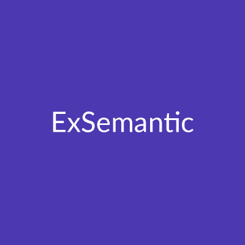

  

    
Welcome to ExSemantic's blog, where we showcase our experiments with different technologies. The main programming language of discourse is Elixir. The blog is organised using the <a href="https://fortelabs.com/blog/para/" target="_blank" rel="noopener noreferrer">PARA</a> method developed by <a href="https://medium.com/@fortelabs" target="_blank" rel="noopener noreferrer">Tiago Forte</a>.

  

  

    
  

